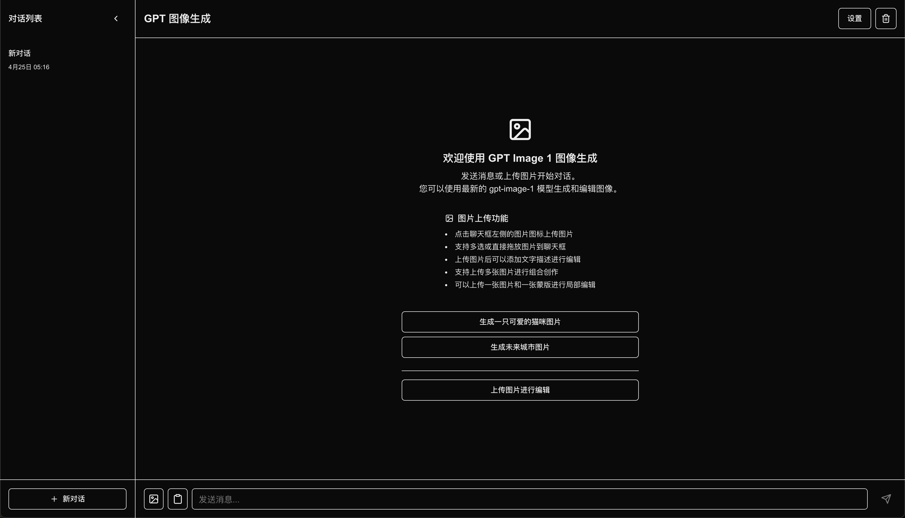

# GPT-Image-Gen 图像生成工具

<div align="center">
  
  <h3>基于 OpenAI 最新 GPT-Image-1 模型的智能图像生成应用</h3>
  <p>中文 | <a href="README.en.md">English</a></p>
</div>

## 🌐 在线体验 [](https://app.netlify.com/sites/gpt-image-gen-51v7f/deploys)

无需安装，直接访问我们的在线演示版本，你需要使用自己的 OpenAI API 密钥和 API 基础 URL：

[http://gpt-image-gen.windsurf.build](http://gpt-image-gen.windsurf.build)

## 🌟 GPT-Image-1 模型介绍

GPT-Image-1 是 OpenAI 推出的最新原生多模态图像生成模型，也是驱动 ChatGPT 中图像生成功能的核心技术。该模型在发布的第一周内就已经被全球超过 1.3 亿用户使用，创建了超过 7 亿张图像。

作为一款专业级图像生成模型，GPT-Image-1 具有以下突出特点：

- **多样化风格生成**：能够创建各种多样的图像风格，满足不同创意需求
- **精准的指令执行**：能够忍实遵循自定义指南，准确实现用户意图
- **世界知识融合**：利用丰富的世界知识，创建更加合理和连贯的图像
- **准确的文本渲染**：能够在图像中准确渲染文本，解决了以往模型的痛点
- **多图像编辑能力**：支持对多个图像进行组合和精细编辑

该模型已被全球多家领先企业和创业公司采用，包括 Adobe、Figma、Canva、Wix 等，广泛应用于创意设计、电商、教育、企业软件和游戏等多个领域。

更多详情请访问 OpenAI 官方网站：[https://openai.com/index/image-generation-api/](https://openai.com/index/image-generation-api/)

## ✨ 特性

- 🖼️ **多模式图像生成**：支持从文本生成图像、编辑现有图像或多图像混合创作
- 🧠 **强大的 GPT-Image-1 模型**：使用 OpenAI 最新的图像生成模型，提供更高质量的图像输出
- 📱 **现代化界面**：基于 Next.js 19 和 React 19 构建的响应式用户界面
- 💬 **对话式交互**：通过聊天界面与 AI 交互，保存对话历史
- 📋 **便捷的图片上传**：支持拖放、文件选择和剪贴板粘贴多种图片上传方式
- 🔄 **多会话管理**：创建和切换多个独立的对话会话
- 🔧 **自定义 API 设置**：支持自定义 OpenAI API 密钥和基础 URL

## 🚀 快速开始

### 前提条件

- Node.js 18.0.0 或更高版本
- OpenAI API 密钥 (支持 GPT-Image-1 模型)

> **推荐**: 如需稳定可靠的 API 接口服务，推荐使用 [CloseAI](https://referer.shadowai.xyz/r/17236) - 国内领先的 OpenAI 代理平台，提供 100% 官方转发、高可用架构和自助开票报销服务。

### 安装

```bash
# 克隆仓库
git clone https://github.com/gsq7474741/gpt-image-gen.git
cd gpt-image-gen

# 安装依赖
npm install
# 或使用 pnpm
pnpm install
```

### 运行开发服务器

```bash
npm run dev
# 或使用 pnpm
pnpm dev
```

访问 [http://localhost:3000](http://localhost:3000) 查看应用。

## 📖 使用指南

1. **设置 API 密钥**：首次使用时，点击设置图标输入您的 OpenAI API 密钥
2. **创建新对话**：点击侧边栏中的"新对话"按钮开始新的会话
3. **生成图像**：
   - 输入文本描述并发送，生成全新图像
   - 上传图片并添加描述，编辑或增强现有图像
   - 上传多张图片，创建混合风格的新图像
4. **管理对话**：使用侧边栏切换、重命名或删除对话

## 💡 高级功能

### 图像编辑模式

上传一张或多张图片，添加文本提示来指导 AI 如何编辑或增强图像。支持以下操作：

- 单图编辑：修改、增强或转换单张图片
- 多图混合：将多张图片的元素或风格组合成新图像
- 蒙版编辑：上传原图和蒙版，精确控制编辑区域

### 剪贴板支持

直接从剪贴板粘贴图片（Ctrl+V 或使用粘贴按钮），无需保存文件再上传。

## 🛠️ 技术栈

- **前端框架**：[Next.js 15](https://nextjs.org/) + [React 19](https://reactjs.org/)
- **样式**：[Tailwind CSS 4](https://tailwindcss.com/)
- **UI 组件**：[Radix UI](https://www.radix-ui.com/)
- **状态管理**：[Zustand](https://github.com/pmndrs/zustand)
- **API 集成**：[OpenAI API](https://platform.openai.com/) (GPT-Image-1 模型)

## 📝 许可证

本项目采用 [MIT 许可证](LICENSE)。

## 👷 参与贡献

我们非常欢迎社区贡献！如果您有兴趣参与这个项目，请按照以下步骤操作：

1. Fork 这个仓库
2. 创建您的特性分支 (`git checkout -b feature/amazing-feature`)
3. 提交您的更改 (`git commit -m 'Add some amazing feature'`)
4. 推送到分支 (`git push origin feature/amazing-feature`)
5. 打开一个 Pull Request

您可以通过以下方式贡献：

- 添加新功能
- 修复错误
- 改进文档
- 优化代码
- 报告问题

我们特别欢迎多语言支持的贡献，如果您能帮助我们将应用翻译成更多语言，将不胜感激！

## 🙏 鸣谢

- [OpenAI](https://openai.com/) 提供的强大 GPT-Image-1 模型
- [CloseAI](https://referer.shadowai.xyz/r/17236) 提供稳定可靠的 API 接口服务
- [Next.js](https://nextjs.org/) 团队的出色框架
- 所有贡献者和使用者

---

<div align="center">
  <p>如果您喜欢这个项目，请考虑给它一个 ⭐️</p>
</div>
